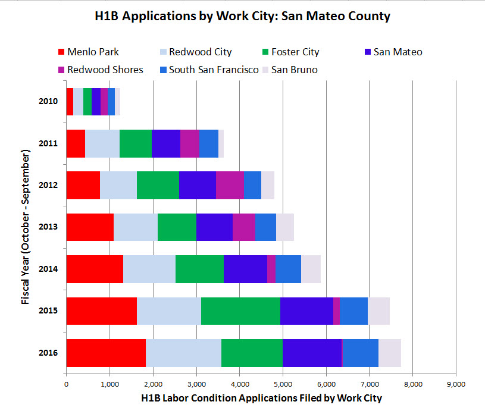
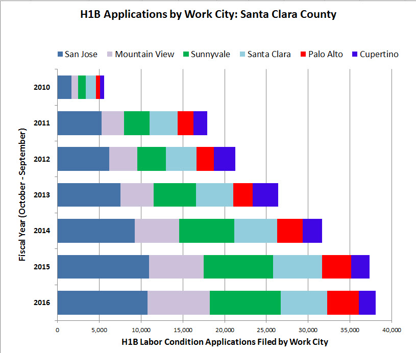
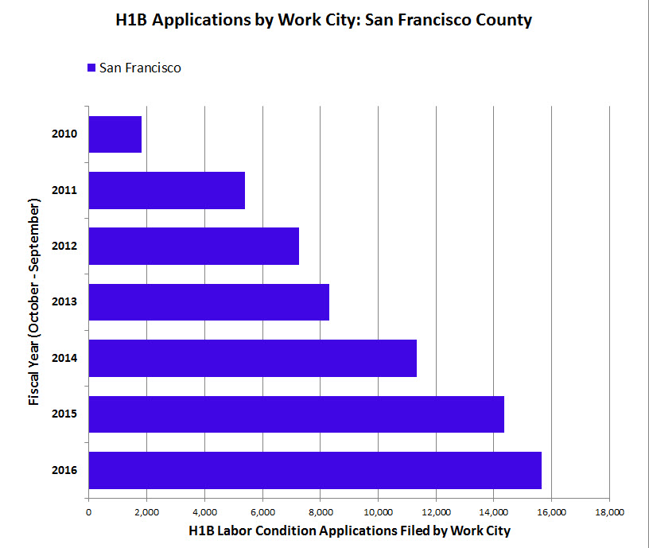

# link: <a href="https://juli2017.github.io/WhoIsWorking/">Who Is Getting the Jobs?</a>

**1 March 2017.**  <a href="https://www.rt.com/usa/379118-laid-off-ucsf-workers-sue/">Laid-off IT workers plan to sue UC San Francisco as jobs outsourced to India </a>

At least 13 employees plan to sue the university for outsourcing their jobs to a group of young men from India, claiming their eliminated jobs amounted to discrimination. Filing a lawsuit will mean no severance pay.

While outsourcing employee abroad isn’t illegal by itself, hiring a group of uniformly young male workers from India runs contrary to a law forbidding bias based on national origin, gender, age, and race.

**18 January 2017.**  <a href="http://www.mercurynews.com/2017/01/18/oracle-paid-white-men-more-than-women-blacks-asians-labor-department-lawsuit/">Oracle paid white men more than women, blacks, Asians: labor department lawsuit</a>

In an explosive lawsuit that threatens lucrative federal contracts, the U.S. Department of Labor has accused Bay Area tech giant Oracle of paying white men more than other workers and favoring Indians for technical jobs.

**15 July 2016.**  <a href="https://www.dailydot.com/debug/facebook-diversity-report-criticism/">Facebook’s latest diversity report draws lots of criticism after showing minimal improvements</a>

In the U.S., 48 percent of people on Facebook’s technical teams are white, 46 percent are Asian, and Hispanic and Black employees are just three and one percent, respectively. Non-technical Facebook workers in the U.S. are 60 percent white, 25 percent Asian, seven percent Hispanic, and five percent Black. 

## The number of foreign workers has increased dramatically in the past ten years in the Bay Area, and large IT companies have been criticized for the lack of age and ethnic diversity in the workers they employ 
As the impact of the housing/job imbalance continues to affect all residents of San Mateo County, is it fair to ask who is getting the new jobs and who is being left behind?

## LCA Applications by Work City 2010 - 2016

  

While there are far fewer H1B Visa applications for cities in San Mateo County than in adjacent San Francisco and Santa Clara counties, all three counties showed rapid growth in the number of Labor Condition Applications (LCA) in the past ten years.
San Mateo county went from 1,242 LCAs in 2010 (fairly evenly spread among the 7 cties included in the data set) to 7,725 in 2016, with almost half of these (3,578) in Menlo Park and Redwood City. Note the decline in LCA filed in 2016 for Redwood Shores, the location of Oracle and the lawsuit mentioned above.  

  
Between 2010 and 2016, Santa Clara County in the heart of Silicon Valley increased the number of LCAs filed in the six cities included in the data set from 5,548 to 38,087!  

  

San Francisco County increased the number of LCAs filed in the ten year period from 1,815 to 15,641.  

### Source: <a href="http://www.myvisajobs.com/H1B_Visa.aspx">H1B Data Website</a> 
H1B Visa Reports were created based Labor Condition Applications (LCA) filed by U.S. employers in fiscal year(1 October-30 September). The number of LCA includes new, renewed, transferred and cap-exempt LCA. 
### Data Source: <a href="https://docs.google.com/spreadsheets/d/1nIkE9t1UokLb5yhP8vmheDDZVKfZqf7UYTZZlx9lvXg/pubhtml">LCA Data Source</a>
Work cities were selected for inclusion in the data set based on their rank and the presence of new IT employers during the 10 year period reported.

Before the H-1B, H-1B1 or E-3 visa petition can be filed with USCIS, the employer must fill a Labor Condition Application(LCA) with the Department of Labor(DOL) through the iCERT Portal System no more than 6 months before the initial date of intended employment, demonstrating that it is paying the required wage for this position in the geographic region where the job is located. The employer may use a single LCA to request multiple positions where they are in the same visa category and job classification, and are either all part-time or all full-time positions.

# News Articles
## 2011
* 22 June 2011: <a href="http://archives.sfweekly.com/sanfrancisco/h1-b-visa-program-creates-caste-system-for-silicon-valley/Content?oid=2181929">H1-B Visa Program Creates Caste System for Silicon Valley </a>

## 2012
* 28 January 2012: <a href="http://www.nytimes.com/2012/01/29/us/bay-area-technology-professionals-cant-get-hired-as-industry-moves-on.html?_r=0">Old Techies Never Die; They Just Can’t Get Hired as an Industry Moves On</a>
* 28 November 2012: <a href="https://www.aol.com/article/2012/11/28/ceo-randy-adams-age-bias-silicon-valley/20390154/">Silicon Valley: Worst Place In America For Over-40 Workers?</a>

## 2013
* 20 August 2013: <a href="http://www.sfgate.com/business/bottomline/article/In-Silicon-Valley-age-can-be-a-curse-4742365.php">In Silicon Valley, age can be a curse</a>

## 2014
* 21 August 2014: <a href="https://www.cnet.com/news/vexed-in-the-city-starved-for-tech-talent-and-yet-nobody-to-hire/">Vexed in the city: Starved for tech talent and yet nobody to hire?</a>

## 2015
* 19 February 2015: <a href="http://www.epi.org/blog/new-data-infosys-tata-abuse-h-1b-program/">New Data Show How Firms Like Infosys and Tata Abuse the H-1B Program</a>
* 16 April 2015: <a href="http://www.breitbart.com/big-government/2015/04/16/american-worker-sues-company-for-discrimination-alleges-it-favors-south-asian-workers/">American Worker Sues Company For Discrimination, Alleges It Favors South Asian Workers</a>
* 4 September 2015: <a href="http://www.computerworld.com/article/2978948/it-careers/older-it-pros-pushed-aside-by-younger-h-1b-workers.html">Older IT pros pushed aside by younger H-1B workers</a>

## 2016
* 11 February 2016: <a href="http://ww2.kqed.org/news/2016/02/11/silicon-valleys-indian-community-pushes-to-reform-h1b-visa-program/">Silicon Valley’s Indian Community Pushes to Reform H1B Visa Program</a>
* 29 February 2016: <a href="https://organizationsandsocialchange.wordpress.com/2016/02/29/will-u-s-tech-jobs-turn-all-indian-the-h1b-visa-dilemma/">Will U.S. Tech Jobs Turn All-Indian? The H1B Visa Dilemma</a>
* 25 November 2016: <a href="http://www.livemint.com/Companies/6FwzsXfqzb0BBrvHrUNzBK/RS-Software-cancels-restrictive-Visa-deal.html">RS Software cancels ‘restrictive’ Visa deal</a>

## 2017
* 3 February 2017: <a href="https://qz.com/901292/indian-it-firms-like-wipro-tcs-and-infosys-have-been-preparing-for-changes-in-h1b-visa-laws-and-donald-trumps-america-for-several-years/">Indian IT firms have been preparing for changes in H-1B visa laws for nearly a decade</a>

